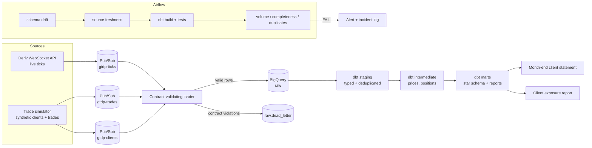
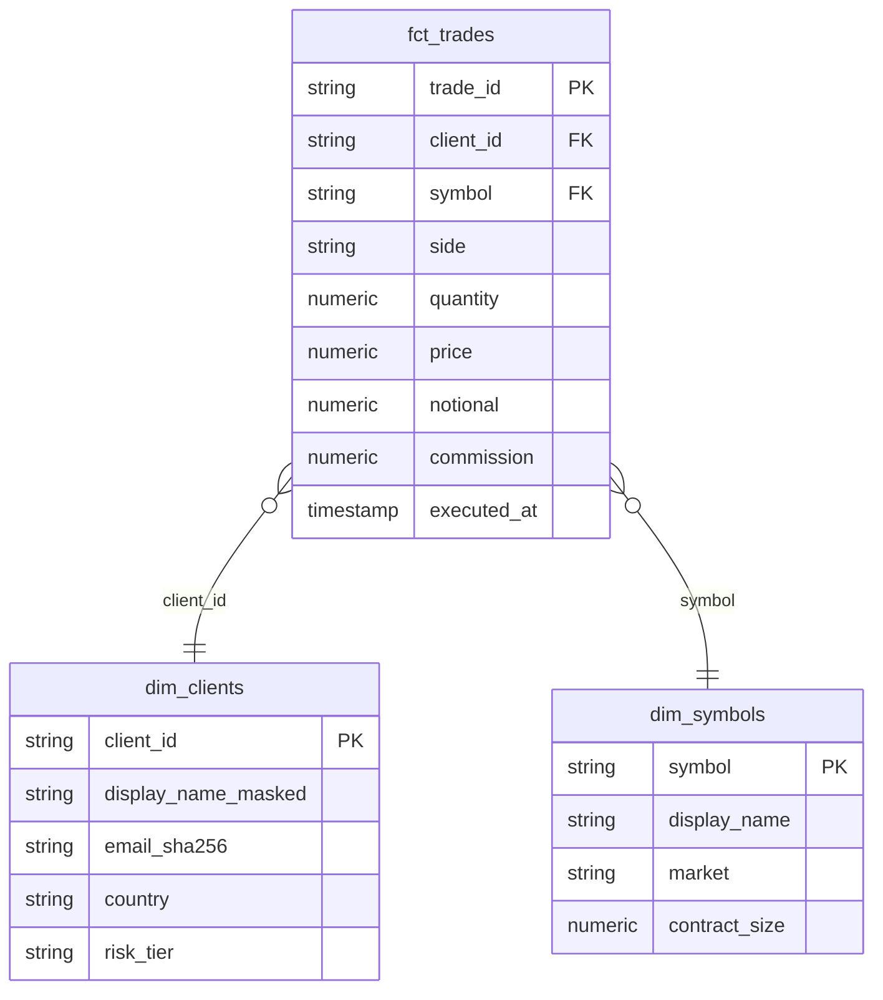

# Governed Trading Data Platform

A trading data platform that streams live Deriv market prices and simulated
client trades into BigQuery, and turns them into a **month-end client
statement** and a **client exposure report**.

The pipeline is built around one rule: compliance numbers are never late,
never duplicated, and never silently wrong. When something upstream breaks,
the pipeline stops and tells someone. It does not publish a quietly wrong
report.

`Python` · `SQL` · `BigQuery` · `dbt` · `Airflow` · `Pub/Sub` · `Docker` · `GitHub Actions`

> **Status: in progress.** See [Roadmap](#roadmap) for what is built and
> what is still planned.

---

## Why this exists

Client statements and exposure reports are regulated outputs. The usual
ways they go wrong are boring:

| Failure | What it looks like downstream |
|---|---|
| Late data | Statement is missing the last hours of the month and nobody notices |
| Duplicate events | A retried message counts a trade twice, so the client's position doubles |
| Upstream schema change | A renamed column turns into `NULL`s, and totals shrink without any error |
| Volume drop | A producer dies quietly and the report shows "no trading" |

Every one of these produces a report that *looks* fine. This platform
checks for each of them on every run and **fails loudly** when it finds one.

---

## Architecture



### Layers

| Layer | Dataset | What happens there |
|---|---|---|
| **Raw** | `raw` | Append-only, exactly as received. Every row is checked against its data contract before insert. Rows that fail go to `raw.dead_letter` with the reason attached. |
| **Staging** | `staging` | One model per source. Types are cast, names are standardised, and duplicates are removed on the primary key (first arrival wins). |
| **Intermediate** | `intermediate` | Daily close prices, and client × symbol × month position roll-forwards. |
| **Marts** | `marts` | Star schema (`fct_trades`, `dim_clients`, `dim_symbols`) plus the two reports. Every mart has an enforced dbt contract. |
| **PII** | `pii` | The only place client names and emails exist in clear text. Access is restricted by role. |

### Star schema



---

## Findings so far

**Deriv's `tick.id` is not a tick id.** The first live run showed that
`tick.id` is the *subscription* id: every tick on a stream carries the same
value. Keying ticks on it would have made staging's deduplication collapse
each symbol's entire price history into one row, and every statement would
have been valued off a single stale price, with no error raised. Ticks are
now keyed on `symbol:epoch`, the Deriv id is kept as `subscription_id`, and a
test pins the behaviour
([`tests/test_deriv_stream.py`](tests/test_deriv_stream.py)).

**The legacy Deriv endpoint is gone.** `wss://ws.derivws.com/websockets/v3`
now returns HTTP 520 for the public demo `app_id`. The streamer uses Deriv's
new public market-data socket
(`wss://api.derivws.com/trading/v1/options/ws/public`), which needs no login.
The request and response format is unchanged. A rejected handshake is now
retried with backoff instead of crashing the streamer.

---

## Data contracts

Each raw table has a YAML contract in [`contracts/`](contracts/). The
contract is the single source of truth, and it is used in three places:

1. **At ingestion.** The loader validates every message against it: required
   fields, types, allowed values, minimums, and no unknown fields. A message
   that fails never reaches the raw table. It goes to the dead-letter table
   instead.
2. **At the warehouse boundary.** Before dbt runs, a schema-drift check
   compares the live BigQuery table schema with the contract. A renamed,
   dropped, added, or retyped column **fails the Airflow run and raises an
   alert**, so the reports are never built on a changed source.
3. **In CI.** A test checks that dbt's `sources.yml` declares the same
   columns as the contracts, so the two cannot drift apart.

The marts use dbt's own enforced model contracts (`contract: {enforced: true}`),
so a model that would change its output shape fails to build.

---

## Data quality checks

| Check | Where | Fails when |
|---|---|---|
| Contract validation | Loader, per message | Missing / mistyped / unexpected field, value out of range |
| Schema drift | Airflow, before dbt | Live table schema ≠ contract |
| Freshness | Airflow (thresholds mirrored in dbt sources; CI keeps them in sync) | Newest row is older than the contract's `error_after_minutes` |
| Completeness | Airflow | An expected symbol has had no ticks in the last window |
| Duplicates | Raw: warn · Marts: fail | Raw: same key arrived twice (handled by staging dedup). Conflicting duplicates (same key, different content) fail. Marts: `unique` tests |
| Volume anomaly | Airflow | Last complete hour's row count is more than 3σ away from the trailing 7-day hourly baseline |

Every check writes a row to `ops.dq_results`, so there is a history of what
passed and what failed.

---

## Governance

- **PII masking.** `dim_clients` has no clear-text PII. Names are masked
  (`J*** D***`) and emails are SHA-256 hashed, so analysts can still join
  and count distinct clients. Clear text exists only in `pii.pii_clients`.
- **Role-based access.** Planned: BigQuery dataset IAM plus policy tags.
  `analyst` can read `marts`. `compliance` can also read `pii`. Only the
  pipeline service account can write to `raw`.
- **Auditability.** Raw is append-only. Rejected messages are kept with
  their error. Check results are stored in `ops`.

---

## Proving the checks work (failure injection)

Saying the checks work is not enough; they need to be shown catching real
failures. Planned injection scenarios, each recorded in
[`docs/incident_log.md`](docs/incident_log.md) with detection time and what
caught it:

| Scenario | Injected by | Expected catch |
|---|---|---|
| Late data | Pause the producer / backdate `ingested_at` | Freshness check |
| Renamed column | `ALTER TABLE raw.trades RENAME COLUMN price TO px` | Schema drift check stops the run |
| Duplicate trades | Republish a batch of trades | Raw duplicate warning; marts stay unique |
| Conflicting duplicate | Republish a trade with a changed quantity | Duplicate check fails |
| Bad payload | Publish `side = "HOLD"` | Loader contract validation → dead letter |
| Producer outage | Stop the simulator for an hour | Volume anomaly + freshness |

---

## Repository layout

```
contracts/            YAML data contracts for every raw table
src/gtdp/
  config.py           Settings from environment variables
  contracts.py        Contract loading, record validation, BigQuery schema
  sinks.py            Where producers publish: Pub/Sub or local JSONL
  alerts.py           Alerting (log + optional webhook)
  ingestion/
    deriv_stream.py   Deriv WebSocket tick subscriber
    trade_simulator.py  Synthetic clients and trades priced off live ticks
    loader.py         Pub/Sub -> contract validation -> BigQuery / dead letter
  quality/
    checks.py         Pure check logic (freshness, volume, drift, ...)
    runner.py         Runs checks against BigQuery, stores results, alerts
  bootstrap.py        Creates Pub/Sub topics and BigQuery datasets/tables
  cli.py              `python -m gtdp ...`
dbt/                  dbt project (staging / intermediate / marts)
airflow/dags/         Hourly quality + build DAG, month-end statement DAG
tests/                pytest suite (no cloud access needed)
docs/incident_log.md  Record of injected failures and what caught them
```

---

## Quickstart

### 1. Local, no cloud account needed

Streams live Deriv ticks and simulated trades to local JSONL files.

```bash
python -m venv .venv
source .venv/bin/activate          # Windows: .venv\Scripts\activate
pip install -e ".[dev]"

cp .env.example .env
GTDP_SINK=local python -m gtdp stream --duration 60
ls data/landing/                    # ticks/ trades/ clients/
pytest                              # 47 tests, no cloud access needed
```

### 2. Full pipeline on GCP

```bash
gcloud auth application-default login
export GCP_PROJECT=your-project

python -m gtdp bootstrap            # topics, subscriptions, datasets, raw tables
GTDP_SINK=pubsub python -m gtdp stream &
python -m gtdp load &               # Pub/Sub -> BigQuery

cd dbt && dbt deps && dbt seed && dbt build
python -m gtdp check all
```

### 3. Docker

```bash
docker compose up --build           # Pub/Sub emulator + streamer + Airflow
```

---

## Roadmap

**Phase 1: Ingestion and contracts** *(built)*
- [x] Data contracts for ticks, trades, clients
- [x] Deriv WebSocket streamer with reconnect/backoff
- [x] Trade simulator priced off live ticks
- [x] Pub/Sub / local sinks
- [x] Contract-validating loader with dead-letter table
- [x] BigQuery + Pub/Sub bootstrap

**Phase 2: Warehouse** *(built, not yet run against a live project)*
- [x] dbt staging with deduplication
- [x] Star schema marts with enforced contracts
- [x] Month-end client statement and exposure report
- [x] PII masking in `dim_clients`

**Phase 3: Checks and orchestration** *(in progress)*
- [x] Freshness, completeness, duplicate, schema-drift, volume-anomaly checks
- [x] Airflow DAGs
- [ ] Deploy and run end to end on GCP
- [ ] BigQuery IAM + policy tags for role-based access
- [ ] Failure injection scripts + filled-in incident log
- [ ] Results and screenshots in this README
